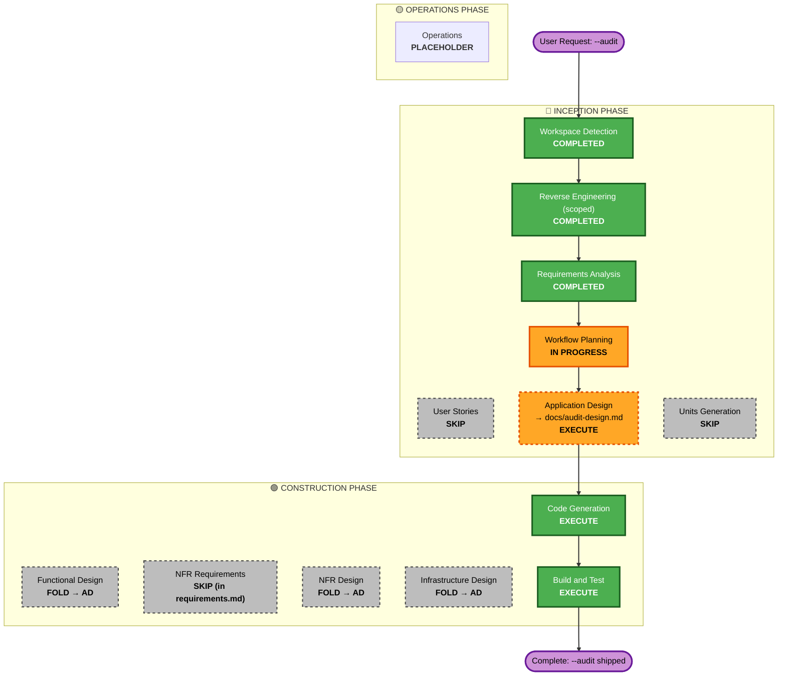

# Execution Plan — M7 `--audit` Network Audit Log

**Created**: 2026-08-13T14:44:18Z
**Stage**: INCEPTION — Workflow Planning
**Scope confirmed at Requirements gate**: Full implementation (Inception → Construction).

## Detailed Analysis Summary

### Transformation Scope (Brownfield)
- **Transformation Type**: Single-component application change **plus** an
  infrastructure change (a new compose-generated sidecar + network rewiring).
  Not an architectural transformation — it reuses the existing fragment pattern.
- **Primary Changes**:
  1. New `--audit` (+ `--audit-decrypt`, `--audit-allow-degraded`) flag handling
     in `trigon-up.sh`.
  2. A runtime-generated compose fragment: an audit gateway sidecar (mitmproxy)
     that is the agent's sole egress path (agent on an `internal` network,
     sidecar dual-homed) — reuses the `--air-gap` topology (`trigon-up.sh:650-703`)
     and the litellm sidecar shape (`:419-446`).
  3. A host-side summary/parse helper (`lib/*.py`) for the session summary from
     the JSONL log.
- **Related Components**: `compose/base.yml` (network defaults), the cleanup trap
  (`:351`/`:361`), the incompatibility-guard block (`:388-391`, `:652-661`),
  `--help`/usage text, README flags table, `tests/cli/`.

### Change Impact Assessment
- **User-facing changes**: **Yes** — three new opt-in flags; a new `audit-log/`
  directory appears in the mounted project on `--audit` runs; documented in
  `--help` + README.
- **Structural changes**: **Yes (contained)** — a new sidecar container and an
  internal-network topology, but built entirely from the existing fragment
  mechanism; no change to the launcher's overall architecture.
- **Data model changes**: **Yes (new, local)** — a versioned JSON Lines record
  schema + a summary format. No database.
- **API changes**: **No** — no service interfaces or contracts.
- **NFR impact**: **Yes (high)** — security-critical: enforced routing,
  least-privilege gateway capabilities (NFR-9), secret/PII redaction on the
  decrypt path (NFR-1), log tamper-resistance (NFR-4), fail-closed default
  (NFR-5), pinned image (NFR-6), cert-pinning compatibility (NFR-2).

### Component Relationships
- **Primary Component**: `trigon-up.sh` (flag parsing, fragment generation,
  guards, env injection).
- **Infrastructure Components**: generated audit-gateway compose fragment;
  `compose/base.yml` (baseline network); interaction with the `--air-gap` and
  litellm fragments.
- **Shared Components**: `lib/` Python helper (log summary/parse) — new.
- **Dependent Components**: `--playwright` guard (refuse), `--playwright-headless`
  (must route through gateway), litellm sidecar ordering.
- **Supporting Components**: `tests/cli/audit.bats`, host-side unit test + PBT for
  the serializer/parser, `--help`/README docs.

| Related component | Change type | Reason | Priority |
|---|---|---|---|
| `trigon-up.sh` | Major | New flags, fragment gen, guards | Critical |
| Audit gateway fragment (generated) | Major (new) | Core mechanism | Critical |
| `lib/` summary helper | Minor (new) | FR-5 summary | Important |
| `compose/base.yml` | Config | Network baseline compatibility | Important |
| litellm fragment interaction | Minor | Gateway ordering (open Q) | Important |
| `--playwright*` guards | Config | FR-7 refuse / headless routing | Important |
| Tests + docs | Minor | NFR-8, `--help`, README | Important |

### Risk Assessment
- **Risk Level**: **Medium** — security-sensitive with real unknowns in the
  networking layer (can a Compose internal-net + dual-homed sidecar *force* all
  egress through the gateway, and at what capability cost — NFR-9; does Node/undici
  in Claude Code honor the injected CA on the `--audit-decrypt` path — NFR-2).
- **Rollback Complexity**: **Easy** — strictly opt-in (default off, FR-6/Q6);
  not passing `--audit` preserves current behavior exactly. Generated fragments
  are cleaned by the existing trap (NFR-7).
- **Testing Complexity**: **Moderate** — `--dry-run` fragment assertions and the
  host-side serializer/PBT run without Docker (NFR-8); the *enforced-routing* and
  *decrypt* guarantees need live-container verification (parked-Docker caveat, as
  with the security-hardening controls).

## Workflow Visualization

## Phases to Execute

### 🔵 INCEPTION PHASE
- [x] Workspace Detection (COMPLETED)
- [x] Reverse Engineering — scoped to networking/egress (COMPLETED)
- [x] Requirements Analysis (COMPLETED)
- [x] User Stories — **SKIP**
  - **Rationale**: Single operator/DPO persona; no multi-user UX. This is an
    infrastructure/CLI control, not a user-journey feature. (workflow-planning §3.1
    "Skip IF: infrastructure changes".)
- [x] Workflow Planning (IN PROGRESS)
- [ ] Application Design — **EXECUTE** → `docs/audit-design.md`
  - **Rationale**: A genuinely new component (audit gateway sidecar) and a new
    network topology need design: the enforced-routing mechanism, the minimum
    capability set (NFR-9), the JSONL schema + summary, CA handling on the decrypt
    path, log ownership for tamper-resistance (NFR-4), fail-closed startup (NFR-5),
    and the decrypt-failure policy (NFR-10). This is the primary design deliverable.
- [ ] Units Generation — **SKIP**
  - **Rationale**: Single component, no multi-package coordination. The one data
    structure (the versioned JSONL record) is small and defined directly in
    Application Design; a separate units-planning artifact adds ceremony without
    value.

### 🟢 CONSTRUCTION PHASE
- [ ] Functional Design — **FOLD into Application Design**
  - **Rationale**: The functional logic (flag parsing, fragment generation, guard
    ordering, summary helper) is a single bash flow + one Python helper; it is
    specified inline in `docs/audit-design.md` rather than as a separate artifact.
- [ ] NFR Requirements — **SKIP**
  - **Rationale**: Already fully enumerated as NFR-1…NFR-10 and the Security
    Compliance Summary in `requirements.md`; no new NFRs to elicit.
- [ ] NFR Design — **FOLD into Application Design**
  - **Rationale**: The NFR *design decisions* (redaction strategy, capability
    scoping, image pinning, fail-closed, cert-pinning fallback) are the crux of the
    design doc and are written there directly, tied to each NFR.
- [ ] Infrastructure Design — **FOLD into Application Design**
  - **Rationale**: The "infrastructure" is one generated compose fragment + network
    topology + capability set; designed inline in `docs/audit-design.md`. No CDK/
    Terraform/cloud infra.
- [ ] Code Generation — **EXECUTE (ALWAYS)**
  - **Rationale**: Implement `--audit` in `trigon-up.sh`, the generated fragment,
    the `lib/` summary helper, `--help`/README updates.
- [ ] Build and Test — **EXECUTE (ALWAYS)**
  - **Rationale**: `tests/cli/audit.bats` (dry-run fragment assertions), host-side
    unit + PBT for the serializer/parser (NFR-8), shellcheck/`bash -n` (CI parity).
    Live-container verification of enforced routing + decrypt is flagged as a
    parked-Docker item, consistent with the security-hardening controls.

### 🟡 OPERATIONS PHASE
- [ ] Operations — PLACEHOLDER (no deployment/monitoring pipeline for a CLI tool).

## Module Update Strategy
- **Update Approach**: Sequential, single critical path (one repo, one script).
- **Critical Path**: `trigon-up.sh` flag/fragment logic → generated fragment
  content → `lib/` summary helper → tests/docs.
- **Coordination Points**: fragment ordering vs. the litellm sidecar and
  `--playwright-headless` (open design question, resolved in Application Design).
- **Testing Checkpoints**: `--dry-run` fragment assertions first (no Docker);
  host-side serializer/PBT next; live-container verification parked.
- **Rollback**: Feature is opt-in (default off); reverting = not passing `--audit`.

## Estimated Timeline
- **Total stages to execute**: 3 (Application Design, Code Generation, Build & Test).
- **Estimated Duration**: Application Design ~1 working session; Construction
  ~1–2 sessions (code + tests + docs), plus a parked live-container verification pass.

## Success Criteria
- **Primary Goal**: A working, opt-in `--audit` that produces an **unbypassable**,
  complete record of container egress destinations, destination-only by default,
  with `--audit-decrypt` for honest-flow depth.
- **Key Deliverables**:
  1. `docs/audit-design.md` (design deliverable).
  2. `--audit` / `--audit-decrypt` / `--audit-allow-degraded` in `trigon-up.sh`
     + generated audit-gateway fragment.
  3. `lib/` summary/parse helper.
  4. JSONL log + human summary in `audit-log/`.
  5. `tests/cli/audit.bats` + host-side serializer/PBT tests; `--help` + README.
- **Quality Gates**:
  - `--dry-run` shows the audit fragment; guards refuse `--audit` + `--playwright`
    and fail-closed when the proxy can't start.
  - Serializer/parser passes PBT-02/03/07/08/09 (enforced).
  - shellcheck + `bash -n` + `--help` green (CI parity).
  - **Integration (parked, Docker):** live run confirms enforced routing (agent
    cannot reach the internet except via the sidecar), `--air-gap --audit` shows
    zero-egress, and `--audit-decrypt` doesn't break the agent's own provider calls.

## Open Items Carried into Application Design
(from `requirements.md` → Open Design Questions)
- Exact enforced-gateway mechanism + minimum capability (NFR-9).
- Gateway ordering when litellm sidecar is present.
- CA generation/trust per-agent on the `--audit-decrypt` path (Node/undici).
- Log ownership/volume for NFR-4 without heavy UX cost.
- Whether `--playwright-headless` egress routes through the gateway (should, it
  stays namespaced).
- Decrypt-failure default policy: fail-closed vs pass-through-SNI (NFR-10).
